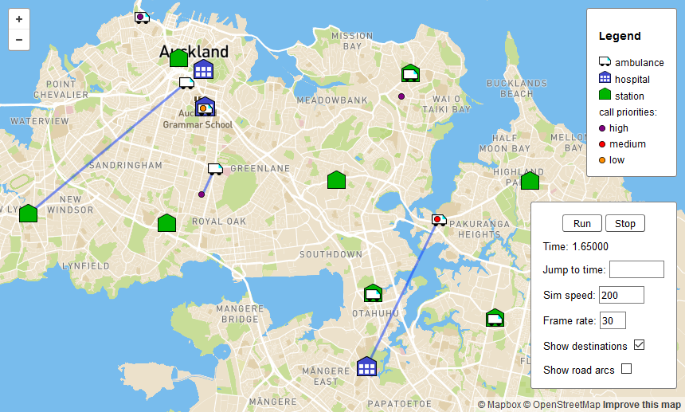

# JEMSS.jl

[](https://travis-ci.com/uoa-ems-research/JEMSS.jl)
[](https://coveralls.io/github/uoa-ems-research/JEMSS.jl?branch=master)
[](http://codecov.io/github/uoa-ems-research/JEMSS.jl?branch=master)

## Installation
To install and build this package, run the following command in the Pkg REPL mode (entered by pressing `]` from the Julia REPL; press backspace to get back):
```julia
pkg> add https://github.com/uoa-ems-research/JEMSS.jl
```

## Simulation example
To run an example script that loads and runs a simulation and then writes statistics to files:
```julia
using JEMSS
include(joinpath(JEMSS.jemssDir, "example/example.jl"))
```
This [example](example/example.jl) is for Auckland city, focusing on the urban area.
The simulation is initialised from a configuration file ([sim_config.xml](example/input/sim_config.xml)) which contains a list of input files (files for ambulances, calls, stations, road network, etc.) and other parameters.
The output files will be written to the folder example/output.
The first time that this script is run it will take an additional minute or so to compute and serialise the all-pairs shortest-path data for the road network; subsequent runs will be faster as they read the serialised data.
After this script has been run, the simulation can be animated with `animate!(sim)`.

A list of further example scripts that may be useful can be found in [example/other_examples.jl](example/other_examples.jl).

## Animation
To animate a simulation:
```julia
using JEMSS
sim = initSim("config_filename");
animate!(sim; port = 8001)
```
The call to `animate!` will open a web browser window to `localhost:8001` (other port numbers may be used).
The connection may take a few seconds to be established.
The browser window, using [Mapbox](https://www.mapbox.com/), will show a map containing the `sim` region, the ambulances, hospitals, stations, and roads.
Controlling the animation is done with buttons and text input in a box at the bottom right of the window.
To have lines drawn between each ambulance and its destination, check the 'Show destinations' box.
The 'Show road arcs' check-box is provided so that the road network arcs can be hidden, which reduces the computation required to display the city while the simulation is running.



Notes on animation:

- Firefox and Chrome work, Edge does not work well, other browsers have not been tested.
- Multiple browser windows may use the same port.
- For the timing control, 'Sim speed' is the ratio of simulation time to real time; speed of 1 gives real-time (real slow) simulation. This requires the input files to have time units in days.
- Input files should have (latitude, longitude) coordinates, these correspond with the y and x fields in the input files.

## Misc
See readme files in subfolders of JEMSS/data/cities/*/data for data sources and license details of files in the respective folder.

For solving linear and integer programs, CBC and GLPK solvers are used, though [Gurobi](https://www.gurobi.com/) will be used (for difficult problems such as p-median and DDSM in JEMSS) if it is installed along with the [Gurobi.jl](https://github.com/jump-dev/Gurobi.jl) package, as Gurobi generally solves faster.

Backslashes are special characters in Julia strings and so if a path includes backslashes (e.g. `"path\to\file.txt"`), it needs to be handled as a raw string (`raw"path\to\file.txt"`) or a substitution string (`String(s"path\to\file.txt")`).

## License
This project is licensed under the Apache License 2.0 - see the [LICENSE.md](LICENSE.md) file for details.
